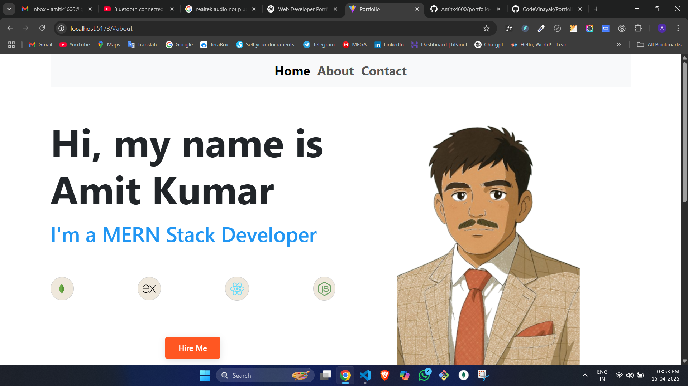
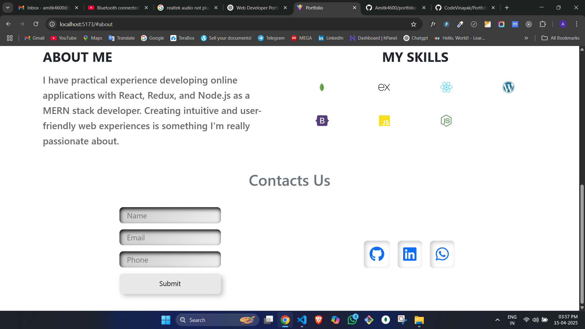

# Personal Portfolio

A modern and responsive portfolio website built with React and Vite to showcase my projects and skills as a MERN stack developer.

## 📸 Screenshots






## 🚀 Technologies Used

- React.js
- Vite
- Node.js
- Express.js
- MongoDB
- Bootstrap
- Font Awesome
- JavaScript (ES6+)
- CSS3
- HTML5

## ✨ Features

- Responsive design
- Modern UI/UX
- Interactive components
- Skills showcase
- About section
- Portfolio/Projects section
- Navigation bar
- Footer with contact information

## 🛠️ Installation

1. Clone the repository

```bash
git clone [https://github.com/Amitk4600/portfolio-.git]
cd portfolio
```

2. Install dependencies

```bash
npm install
```

3. Run the development server

```bash
npm run dev
```

The site will be available at `http://localhost:5173`

## 🏗️ Building for Production

To create a production build:

```bash
npm run build
```

## 📝 Project Structure

```
portfolio/
├── public/
│   ├── hero.png
│   └── vite.svg
├── src/
│   ├── assets/
│   │   └── icons/
│   ├── components/
│   │   ├── About.jsx
│   │   ├── Footer.jsx
│   │   ├── Hero.jsx
│   │   └── Navbar.jsx
│   ├── App.jsx
│   ├── main.jsx
│   ├── App.css
│   └── index.css
└── package.json
```
